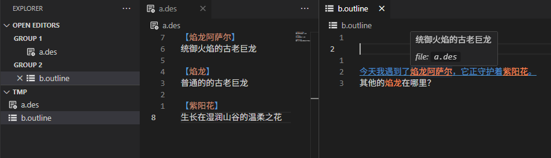

# Design-Resolve

## 设定(.des)和大纲(.outline)

设定(design): .des
大纲(outline): .outline

## 高亮和跳转（Highlight and jump）

`a.des / b.outline`:

1. 贪婪匹配，按住 `ctrl` 左键点击 `.outline` 内的高亮部分跳转到 `.des` 中的定义(greedy match, hold `ctrl` and click the highlight part in `.outline` jump to the definition inside `.des`)
2. 悬浮展示(hover and show details)
